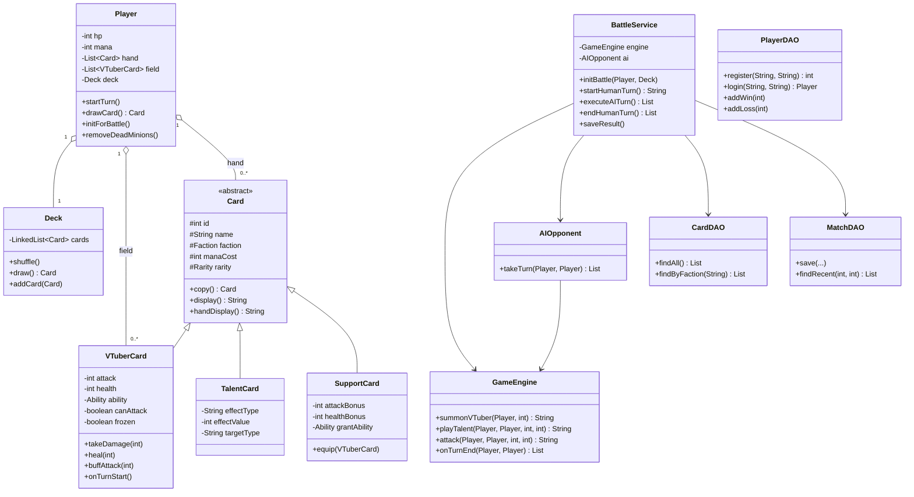
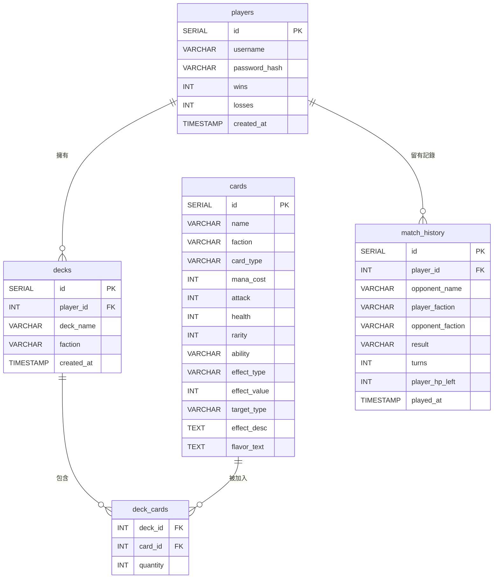

# 🃏 VTuber Card Battle

以 VTuber 為主題的 CLI 卡牌對戰遊戲，玩家選擇陣營、組建牌組，與 AI 對手進行回合制對戰。

**適合對象**：對 Java 後端開發、OOP 設計模式、JDBC 資料庫整合有學習需求的開發者。

---

## 專案簡介

本專案以 Hearthstone 類型的卡牌遊戲為核心，透過 CLI 介面讓玩家體驗完整的遊戲流程。所有卡牌資料儲存於 PostgreSQL，透過 JDBC 讀取，並將每場對戰結果寫回資料庫做為戰績記錄。

**技術要點**：
- MVC 架構分層（model / dao / service / view）
- 繼承與多型（`Card` 抽象類別 → `VTuberCard` / `TalentCard` / `SupportCard`）
- `PreparedStatement` 防止 SQL Injection
- `try-with-resources` 確保 JDBC 資源正確釋放
- 自定義例外（`FieldFullException`、`NotEnoughSCException` 等）

---

## Mermaid 設計圖

### 類別圖（Class Diagram）



### ERD（資料庫關聯圖）



---

## 目錄結構

```
game_data/
├── lib/
│   └── postgresql-42.7.3.jar
├── sql/
│   └── schema.sql              ← 建表 + 49 筆初始資料
├── src/main/java/com/vcb/
│   ├── Main.java
│   ├── config/
│   │   └── DatabaseConfig.java
│   ├── dao/
│   │   ├── CardDAO.java
│   │   ├── DeckDAO.java
│   │   ├── MatchDAO.java
│   │   └── PlayerDAO.java
│   ├── exception/
│   │   ├── FieldFullException.java
│   │   ├── MustAttackTauntException.java
│   │   └── NotEnoughSCException.java
│   ├── model/
│   │   ├── Card.java
│   │   ├── Deck.java
│   │   ├── Player.java
│   │   ├── SupportCard.java
│   │   ├── TalentCard.java
│   │   ├── VTuberCard.java
│   │   └── enums/
│   │       ├── Ability.java
│   │       ├── CardType.java
│   │       ├── Faction.java
│   │       └── Rarity.java
│   ├── service/
│   │   ├── AIOpponent.java
│   │   ├── BattleService.java
│   │   ├── DeckService.java
│   │   └── GameEngine.java
│   └── view/
│       ├── BattleView.java
│       └── MenuView.java
├── README.md
├── run.sh
├── run.bat
└── .gitignore
```

---

## 啟動說明

### 1. 環境需求

- Java 17+
- PostgreSQL 14+
- `lib/postgresql-42.7.3.jar`（已包含於專案）

### 2. 建立資料庫

```bash
# 建立資料庫
psql -U postgres -c "CREATE DATABASE vcb;"

# 執行建表 + 匯入卡牌資料
psql -U postgres -d vcb -f sql/schema.sql
```

> 預設帳號：`postgres`　預設密碼：`my_secret_password`
> 若需更改，請修改 `src/main/java/com/vcb/config/DatabaseConfig.java`

### 3. 編譯

```bash
# Mac / Linux
javac -cp "lib/*" -d out -encoding UTF-8 $(find src -name "*.java")

# Windows
javac -cp "lib/*" -d out -encoding UTF-8 $(dir /s /b src\*.java)
```

### 4. 執行

```bash
# Mac / Linux
java -cp "out:lib/*" com.vcb.Main

# Windows
java -cp "out;lib/*" com.vcb.Main
```

或直接使用腳本：

```bash
# Mac / Linux
bash run.sh

# Windows
run.bat
```

---

## CLI 操作截圖

### 主選單 / 登入畫面


```
╔════════════════════════════════════════════╗
║       🃏 VTuber Card Battle 🃏            ║
║           配信宇宙錦標賽                  ║
╚════════════════════════════════════════════╝

[1] 登入  [2] 註冊  [0] 離開
```

### 對戰畫面（戰場渲染）


```
╔════════════════════════════════════════════╗
║  📺 AI-極深空計畫  👥 HP:24/30  💰 SC:3/3  🃏 12張
║  場上: [夜鈴 2/4 [嘲諷]🛡️]
╠════════════════════════════════════════════╣
║  場上: [厄倫蒂兒 4/6]
║  📺 morris1  👥 HP:30/30  💰 SC:2/4  🃏 14張
╚════════════════════════════════════════════╝
── 手牌（3 張）──
  [1] ✨ 天文台連動  💰4  對全體敵方造成 2 點傷害
  [2] 🎤 涅默  💰4  ATK:5 HP:4
  [3] 🎁 3D 演唱會門票  💰4  +3 ATK / +2 HP
```

### 對戰結果 / 戰績查詢


```
══════════════════════════════════════════════════
🎉🎉🎉 你贏了！恭喜！🎉🎉🎉
回合數: 8
剩餘 HP: 12
══════════════════════════════════════════════════

📊 morris1 的戰績
對手              結果   我方陣營    對方陣營   回合  剩餘HP
───────────────────────────────────────────────────────
AI-極深空計畫    🏆 勝  DEEP_SPACE  DEEP_SPACE  8     12
AI-五律悖反      💀 敗  DEEP_SPACE  PARADOX     5     0
```

---

## 陣營剋制表

```
極深空計畫 ──(×1.5)──▶ 瀕臨絕種團
    ▲                        │
  (×1.5)                  (×1.5)
    │                        ▼
瑟拉斯蒂歐 ◀──(×1.5)── 瀕臨絕種團

諦覓司 / 五律悖反：無剋制關係（×1.0）
```

---

## 卡牌統計

| 陣營 | VTuber | 才藝 | 應援 | 小計 |
|------|:------:|:----:|:----:|:----:|
| 極深空計畫 | 4 | 3 | 2 | **9** |
| 瀕臨絕種團 | 3 | 3 | 2 | **8** |
| 瑟拉斯蒂歐 | 4 | 3 | 2 | **9** |
| 諦覓司 | 4 | 3 | 2 | **9** |
| 五律悖反 | 2 | 3 | 1 | **6** |
| 中立 | 0 | 5 | 3 | **8** |
| **合計** | **17** | **20** | **12** | **49** |
